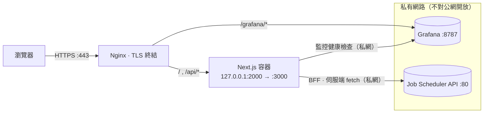
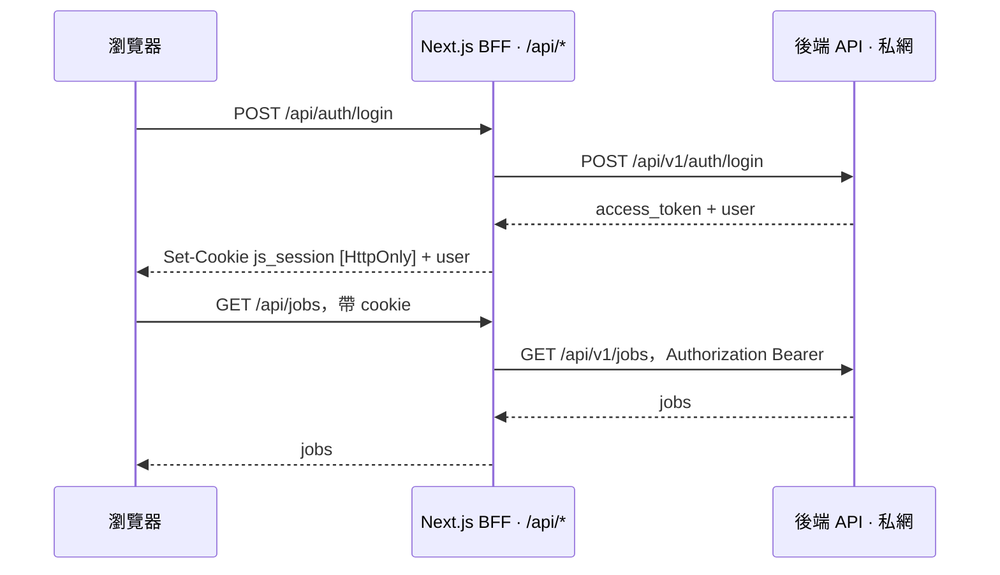

# Job Scheduler — Frontend

分散式非同步任務排程系統的**企業級前端**：提交、排程、監控任務，檢視每次執行（run）與即時 log，
並可手動干預（觸發 / 重跑 / 終止）。採 **Backend-for-Frontend (BFF)** 架構——後端 token 全程留在伺服端，
**永不落地到瀏覽器**。

> **技術**：Next.js 16（App Router）· React 19 · TypeScript · Tailwind v4 · shadcn/ui · SWR。
> 以 standalone 模式打包成 Docker 容器，置於 Nginx 之後。

---

## 專案目標

- **把一套以 API 操作的任務排程後端，變成一個好用、好看、安全的人機介面。** 後端負責排程、佇列、worker
  與執行；前端負責「人」要做的事：建立任務、排程、看狀態、追 log、出事時干預。
- **預設安全**：認證 token 只存在 httpOnly cookie，瀏覽器 JavaScript 讀不到；所有後端呼叫都從伺服端發出，
  瀏覽器永遠看不到後端位址或憑證，只與自己同源的 `/api/*` 對話。
- **可直接上線**：附完整的 Docker / Nginx / DNS / TLS 範本與 runbook，容器只綁 localhost、由反向代理終結 TLS。
- **高資訊密度但乾淨**：OLED 深色主題、語意化狀態色票、等寬表格化的 log 呈現，適合長時間盯著看的維運場景。

---

## 功能特色

- **認證**：登入 / 註冊；session 存於 **httpOnly cookie**。可選的「註冊碼」閘門（伺服端把關，避免被任意註冊）。
- **執行面板 `/tasks`**：
    - 彈出式建立任務（**HTTP / shell / http_async** 三型）、上傳文字檔匯入成**可編輯草稿**。
    - 設定排程（**cron / interval / manual**）與任務**相依**（點擊可視覺化執行順序、防循環）。
    - 常用任務（收藏）、依排程列出下次執行倒數、依分類可收合分組。
    - 行內操作：觸發 / 終止 / 重跑 / 啟停排程 / 刪除 / 編輯，破壞性動作皆二次確認。
- **紀錄面板 `/jobs`**：以 **Run** 為單位、依分類群組、即時狀態徽章、依階段（pending / running / completed / error）篩選。
- **Run 詳情與 Log**：兩種看 log 模式——**彈出視窗**與**分割檢視**（左清單 ↔ 右即時 log）；執行中自動輪詢。
- **監控 `/monitoring`**：以**同源 sub-path** 安全內嵌 Grafana dashboard（健康檢查 gate；後端離線時顯示維護提示）。
- **韌性**：後端離線時自動導向維護頁而非報錯，避免誤判為「帳密錯誤」。
- **設計**：深色 OLED 主題、語意化狀態色票、等寬 + 表格化數字的 log 呈現。

---

## 架構

瀏覽器只與前端自身的網域對話。Nginx 終結 TLS 並把所有流量轉發到 Next.js 容器；容器內的 **BFF 在伺服端**
發出所有後端請求並附帶 token。後端與 Grafana 經**私有網路**連接，**不對公網開放**。



- 對外入口只有 `https://<frontend-domain>`（443）。後端 / Grafana 只在私網。
- 後端位址以 **server-only** 環境變數 `BACKEND_ORIGIN` 設定（例 `http://<backend-host>`），**不寫死、不進 repo**。
- Nginx **不含** `/api → 後端` 區塊：所有後端流量由容器內的 BFF 負責；nginx 只反代到容器。
- 容器只發佈在 `127.0.0.1:2000`（對映容器內 `:3000`），預期由主機上的反向代理終結 TLS 並轉發。

### 認證 / 安全模型

後端簽發的 JWT 存在 httpOnly cookie。瀏覽器呼叫同源 `/api/*` BFF，BFF 掛上 `Bearer` token 再轉發到後端；
瀏覽器 JavaScript 永遠讀不到 token（降低 XSS 竊取風險），也看不到後端位址。



**原則**

- `BACKEND_ORIGIN` 與任何機密皆為 **runtime、server-only** 環境變數，**禁止** `NEXT_PUBLIC_` 前綴
  （會被打包進瀏覽器 bundle）。
- 瀏覽器永遠看不到後端位址或 token，只用相對路徑 `/api/*`。
- `.env` 已 gitignore，repo 只收 `.env.example`。

---

## 技術選型

| 範疇 | 選擇 |
| --- | --- |
| 框架 | Next.js 16（App Router）、React 19、TypeScript |
| 樣式 | Tailwind v4、shadcn/ui（base-nova / @base-ui）、lucide-react |
| 資料 | SWR（active 時輪詢）＋ Server Components |
| 排程計算 | `croner`（前端算 cron 下次執行時間） |
| 型別 | 由後端 OpenAPI schema 以 `openapi-typescript` 產生 |
| 執行 | Node（standalone 輸出）、Docker、Nginx 反向代理 |

---

## 目錄結構

```text
src/
  app/
    (auth)/            登入 / 註冊（公開）
    (app)/             受保護殼層 + tasks / jobs / monitoring
    api/               BFF route handlers（auth、jobs、runs）
    icon / opengraph-image / …   next/og 動態 SEO 圖
  proxy.ts             樂觀 auth 導向（Next.js「middleware」，Next 16 改名）
  lib/                 後端 client、session、BFF proxy、型別、格式化、工具
  components/          UI、app 殼層、tasks、jobs、logs
deploy/                nginx vhost + DNS snippet 範本
Dockerfile             多階段 standalone 映像
docker-compose.yml     以 127.0.0.1:2000 啟動容器
```

---

## 開發

需求：Node 20+、pnpm。

```bash
cp .env.example .env          # 設定 BACKEND_ORIGIN 指向可達的後端
pnpm install
pnpm dev                      # http://localhost:3000
```

常用指令：

```bash
pnpm build                    # 正式建置（standalone）
pnpm exec tsc --noEmit        # 型別檢查
pnpm lint

# 後端 OpenAPI 變更後重新產生型別
pnpm dlx openapi-typescript ./openapi.json -o ./src/types/api.ts
```

---

## Docker

```bash
cp .env.example .env          # 設定 BACKEND_ORIGIN
docker compose up -d --build  # 監聽 127.0.0.1:2000
docker compose ps             # STATUS 應為 healthy
docker compose logs -f web
```

容器只發佈在 `127.0.0.1:2000`，預期由主機上的反向代理終結 TLS 並轉發。

---

## 部署（概要）

1. **容器**：`docker compose up -d --build`（監聽 `127.0.0.1:2000`）。
2. **Nginx**：為 `<frontend-domain>` 設一個 vhost，將 `/ → 127.0.0.1:2000`（範本見
   [`deploy/nginx/`](deploy/nginx/)）；TLS 用 certbot。視需要加 `/grafana/ → Grafana` 反代以啟用監控頁。
3. **DNS**：為子網域加一筆 `A` record（範本見 [`deploy/bind/`](deploy/bind/)）。
4. **後端連線**：主機經私有網路（如 WireGuard）連到後端；容器沿用主機路由連線。**驗證**容器可達後端
   `/healthz` 後再對外。

---

## 設定

| 變數 | 必填 | 說明 |
| --- | --- | --- |
| `BACKEND_ORIGIN` | 是 | 後端 API origin（scheme + host，無 `/api/v1`、無結尾斜線）。server-only。 |
| `NODE_ENV` | — | 容器內為 `production`。 |
| `SITE_URL` | 否 | 對外網址，僅用於組 Open Graph / canonical 連結。 |
| `REGISTER_PASSCODE` | 否 | 設了才啟用註冊碼閘門；由 BFF 把關，不轉給後端。 |
| `GRAFANA_ORIGIN` / `GRAFANA_DASHBOARD_URL` / `GRAFANA_HEALTH_URL` | 否 | 監控頁嵌入 Grafana（同源 sub-path + 健康檢查）。 |

> 機密一律不要加 `NEXT_PUBLIC_` 前綴。完整說明見 `.env.example`。

---

## 授權

Proprietary — 內部專案，保留所有權利。
