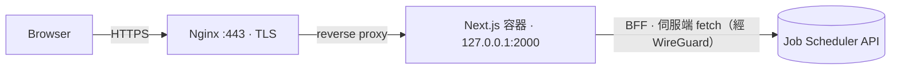
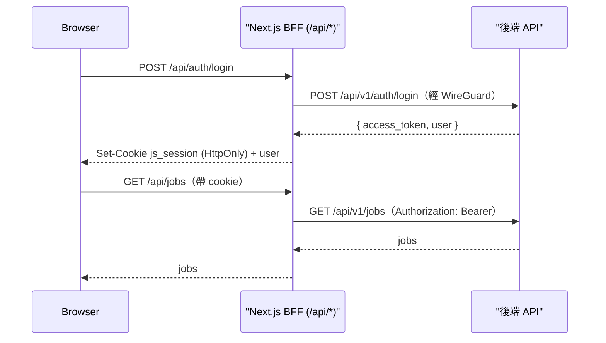

# Job Scheduler — Frontend

分散式非同步任務排程系統的**企業級前端**：提交、排程、監控任務，檢視 run 與即時 log，
並可手動干預（觸發 / 重跑 / 取消）。採 **Backend-for-Frontend (BFF)** 架構，token 不落地到瀏覽器。

**技術**：Next.js（App Router）· TypeScript · Tailwind v4 · shadcn/ui · SWR，
以 standalone 模式打包成 Docker 容器，置於 Nginx 之後。

---

## 功能特色

- **認證**：登入 / 註冊；session 存於 **httpOnly cookie**，瀏覽器 JavaScript 無法讀取。
- **任務執行台 `/tasks`**：彈出式建立任務（HTTP / shell / http_async）、上傳文字檔匯入可編輯草稿、
  設定排程（cron / interval / manual）與任務相依；常用任務快速執行、最近提交一覽、可收合的**操作 Console**。
- **Job 狀態 `/jobs`**：依分類群組、即時狀態徽章、依階段（pending / running / completed / error）篩選。
- **Run 詳情與 Log**：手動干預（觸發 / 重跑 / 取消）＋兩種看 log 模式——**彈出視窗**與
  **分割檢視**（左 job 清單 ↔ 右即時 log），執行中自動輪詢。
- **監控 `/monitoring`**：預留頁（規劃接 Prometheus + Grafana：queue 長度、worker 負載、成功/失敗率）。
- **深色 OLED 設計**，語意化狀態色票，等寬 + 表格化數字的 log 呈現。

---

## 架構

瀏覽器只與前端自身的網域對話。Nginx 終結 TLS 並把所有流量轉發到 Next.js 容器；
容器內的 **BFF 在伺服端**發出所有後端請求並附帶 token。後端經私有網路（WireGuard）連接，
**不對公網開放**。



- 對外入口只有 `https://<frontend-domain>`。
- 後端位址以 server-only 環境變數 `BACKEND_ORIGIN`（例如 `http://<backend-host>`）設定，經 WireGuard
  連到；**不寫死、不進 repo**。
- Nginx **不含** `/api → 後端` 區塊：所有後端流量由 BFF 負責。

### 認證 / 安全模型

後端簽發的 JWT 存在 httpOnly cookie。瀏覽器呼叫同源 `/api/*` BFF，BFF 掛上 Bearer token 再轉發到後端；
瀏覽器 JavaScript 永遠讀不到 token（降低 XSS 竊取風險）。



**原則**

- `BACKEND_ORIGIN` 與任何機密皆為 **runtime、server-only** 環境變數，**禁止** `NEXT_PUBLIC_`
  前綴（會被打包進瀏覽器 bundle）。
- 瀏覽器永遠看不到後端位址或 token，只用相對路徑 `/api/*`。
- `.env` 已 gitignore，repo 只收 `.env.example`。

---

## 技術選型

| 範疇 | 選擇 |
| --- | --- |
| 框架 | Next.js（App Router）、React、TypeScript |
| 樣式 | Tailwind v4、shadcn/ui、lucide-react |
| 資料 | SWR（輪詢）＋ Server Components |
| 型別 | 由後端 OpenAPI schema 以 `openapi-typescript` 產生 |
| 執行 | Node（standalone 輸出）、Docker |

---

## 目錄結構

```
src/
  app/
    (auth)/            登入 / 註冊（公開）
    (app)/             受保護殼層 + tasks / jobs / monitoring
    api/               BFF route handlers（auth、jobs、runs）
  proxy.ts             樂觀 auth 導向（Next.js proxy；舊稱 middleware）
  lib/                 後端 client、session、BFF proxy、型別、工具
  components/          UI、app 殼層、tasks、jobs、logs
deploy/                nginx vhost + DNS snippet 範本
Dockerfile             多階段 standalone 映像
docker-compose.yml     以 127.0.0.1:2000 啟動容器
```

---

## 開發

需求：Node 20+、pnpm。

```bash
cp .env.example .env          # 設定 BACKEND_ORIGIN 指向可達的後端
pnpm install
pnpm dev                      # http://localhost:3000
```

常用指令：

```bash
pnpm build                    # 正式建置（standalone）
pnpm exec tsc --noEmit        # 型別檢查
pnpm lint

# 後端 OpenAPI 變更後重新產生型別
pnpm dlx openapi-typescript ./openapi.json -o ./src/types/api.ts
```

---

## Docker

```bash
cp .env.example .env          # 設定 BACKEND_ORIGIN
docker compose up -d --build  # 監聽 127.0.0.1:2000
docker compose ps             # STATUS 應為 healthy
docker compose logs -f web
```

容器只發佈在 `127.0.0.1:2000`，預期由主機上的反向代理終結 TLS 並轉發。

---

## 部署（概要）

1. **容器**：`docker compose up -d --build`（監聽 `127.0.0.1:2000`）。
2. **Nginx**：為 `<frontend-domain>` 設一個 vhost，將 `/ → 127.0.0.1:2000`
   （範本見 [`deploy/nginx/`](deploy/nginx/)）；TLS 用 certbot。
3. **DNS**：為子網域加一筆 `A` record（範本見 [`deploy/bind/`](deploy/bind/)）。
4. **後端連線**：主機經 WireGuard 連到後端；容器透過主機網路 / 路由沿用此連線。

---

## 設定

| 變數 | 必填 | 說明 |
| --- | --- | --- |
| `BACKEND_ORIGIN` | 是 | 後端 API origin（scheme + host，無 `/api/v1`、無結尾斜線）。server-only。 |
| `NODE_ENV` | — | 容器內為 `production`。 |

> 機密一律不要加 `NEXT_PUBLIC_` 前綴。

---

## 授權

Proprietary — 內部專案，保留所有權利。
